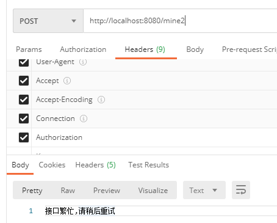

# 接口调用速率限制

### 使用方法

- 引入依赖
  ```java
  <dependency>
    <groupId>site.heaven96</groupId>
    <artifactId>limiter-spring-boot-starter</artifactId>
    <version>1.0.1-SNAPSHOT</version>
  </dependency>
  ```
- 开启过滤
    - 在启动类上添加注解
  ```java
  @SpringBootApplication
  @EnableLimiter
  public class Application {
      public static void main(String[] args) {
          SpringApplication.run(Application.class, args);
      }
  }
  ```
    - 在需要限制速率的接口上进行简单配置
  ```java
  @RestController
  public class LimiterDemoController {
  
      /**
       * 默认配置 每5s可以访问20次 全局的 不区分用户的
       *
       * @return {@link String}
       */
      @PostMapping("mine")
      @Limiter
      public String index(){
          return "asdasd";
      }
  
      /**
       * 每个用户 每5s 1次
       * 用户的身份识别来自于Header的Authorization
       *
       * @param sd sd
       * @return {@link Map}
       */
      @PostMapping("mine2")
      @Limiter(independence = IdentifierType.HEADER, ceiling = 1)
      public Map index(String sd){
          HashMap<Object, Object> objectObjectHashMap = MapUtil.newHashMap();
          objectObjectHashMap.put("123","1233");
          return objectObjectHashMap;
      }
  
      /**
       * 每个用户 每5s 1次
       * 用户的身份识别来自于Header的 MyToken
       *
       * @param sd sd
       * @return {@link Map}
       */
      @PostMapping("mine3")
      @Limiter(independence = IdentifierType.HEADER, ceiling = 1, key = "MyToken")
      public Map index2(String sd){
          HashMap<Object, Object> objectObjectHashMap = MapUtil.newHashMap();
          objectObjectHashMap.put("123","1233");
          return objectObjectHashMap;
      }
  }
  
  ```

### 配置项

#### @EnableLimiter

- 简介：开启限流
- 参数：
    - strategy 缓存策略，用于制定缓存托管的方式
        - LOCAL ：**本地缓存（默认）**
        - REDIS ：**Redis缓存**

#### @Limiter

- 简介：对接口进行限流

- 参数：
    - ceiling：单位时间最大调用次数（上限）默认是 20
    - period：时间周期 默认是 5
    - unit：时间单位，配合上一个属性使用，默认是秒
    - message：错误提示消息
    - independence：用户独立控制限速时，用户身份判断源 默认NONE
        - NONE：不开启独立控制
        - HEADER：用户身份信息在请求头中
        - SESSION：用户身份信息在Session中
        - PARAMETER：用户身份信息在参数中

    - key：放置用户身份信息的键名(不论是在Header还是Parameter或是Session)，默认Authorization

### 异常处理

对于过频的请求会抛出 OverLimitException 的异常，可以视情况捕获处理。 比如可以这样：

```java

@RestControllerAdvice
public class ExceptionHandlers {
    @ExceptionHandler(OverLimitException.class)
    public String sqlExpHandler(OverLimitException e) {
        return e.getMessage();
    }
}
```

### 测试效果

