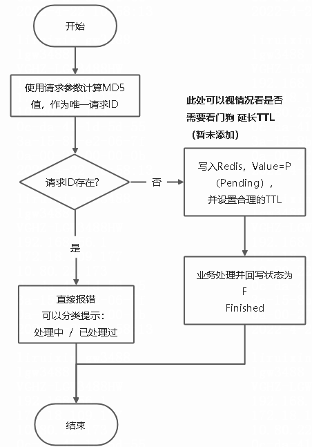

# 重复请求过滤工具

### 问题背景

微服务提供接口供外部系统调用，因对方系统可能存在不稳定性，并可能存在重传机制的缘故，常常会再在短时间收到海量重复请求。 （开发这个工具的时候就是因为调用方的程序出现了异常，导致单一接口短时上万次重复请求）

### 流程



### 使用方法

- 引入依赖
  ```java
  <dependency>
     <groupId>site.heaven96</groupId>
     <artifactId>filter</artifactId>
     <version>{version}</version>
  </dependency>
  ```
- 开启过滤
    - 在启动类上添加注解
  ```java
  @SpringBootApplication
  @EnableDuplicateRequestFilter
  public class Application {
      public static void main(String[] args) {
          SpringApplication.run(Application.class, args);
      }
  }
  ```
    - 指定需要过滤的接口
  ```java
  @PostMapping("test")
  @DuplicateRequestFilter
  public String test(@RequestBody Map map){
    return "sad"+map.toString();
  }
  ```

### 配置项

#### @EnableDuplicateRequestFilter

- strategy
    - LOCAL ：**本地缓存**
    - REDIS ：**Redis缓存**

#### @DuplicateRequestFilter

- ttl： **缓存存活时长**
- timeUnit：**时长单位**
- scope：**校验重复的范围**
    - URL_PARAMS： 仅依据URL参数进行重复性判定
    - REQUEST_BODY： 仅依据Request Body进行重复性判定
    - BOTH： 依据URL参数 和 Request Body进行重复性判定

### 异常处理

对于重复请求会抛出 DuplicateRequestException 的异常，可以视情况捕获处理。 比如可以这样：

```java
  private static final String DUPLICATE_REQUEST_ERR_MSG="重复请求错误：{}";
  @ExceptionHandler(DuplicateRequestException.class)
  public Result sqlExpHandler(DuplicateRequestException e){
        logs.error(DUPLICATE_REQUEST_ERR_MSG,e.getMessage());
        return new Result(false,HttpStatus.INTERNAL_SERVER_ERROR.value(),e.getMessage());
  }
```